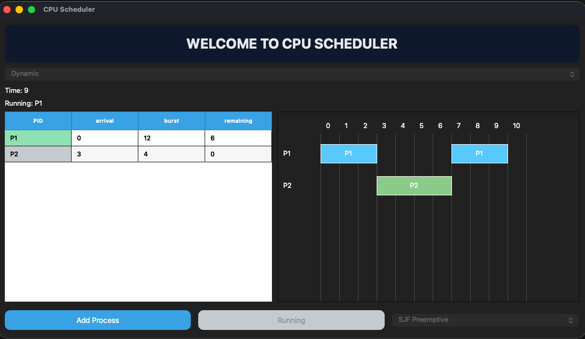

# 🚀 CPU Scheduler Simulator (PyQt6)

## 📌 Overview

This project is a **CPU Scheduling Simulator** built with **Python and PyQt6**.
It visualizes how different scheduling algorithms work using a dynamic Gantt chart and real-time process tracking.

---

## 🎯 Features

* ✅ Multiple Scheduling Algorithms:

  * Shortest Job First (Preemptive & Non-preemptive)
  * Priority Scheduling (Preemptive & Non-preemptive)
  * Round Robin (with user-defined quantum)

* 🎬 Two Modes:

  * **Dynamic Mode** → step-by-step simulation
  * **Static Mode** → instant final result

* 📊 Visualization:

  * Real-time Gantt Chart
  * Running process highlighting
  * Idle time representation

* 📈 Metrics:

  * Average Waiting Time
  * Average Turnaround Time

---

## 🖥️ Tech Stack

* Python
* PyQt6 (GUI)
* Custom Scheduling Engine

---

## ▶️ How to Run

```bash
pip install PyQt6
python main.py
```

---

## 🧠 How It Works

* The system simulates CPU execution **step-by-step**
* At each time unit:

  * New processes are added to the ready queue
  * The next process is selected based on the chosen algorithm
  * Execution updates the timeline and UI

---

## 📸 UI Preview



---

## 📂 Project Structure

```
CPU-Scheduler-Project/
│
├── main.py
├── CoreEngine.py
├── scheduler_Algorithms.py
├── gantt_widget.py
├── table_widget.py
├── models.py
├── README.md
```

---

## 💡 Key Concepts Implemented

* Preemptive vs Non-preemptive scheduling
* Time slicing (Round Robin)
* Process lifecycle simulation
* Real-time visualization

---

## 🏁 Future Improvements

* Export results to CSV
* Speed control slider
* Better UI themes
* More scheduling algorithms

---

## 👨‍💻 Author

**Ziad Elsisi**

---
