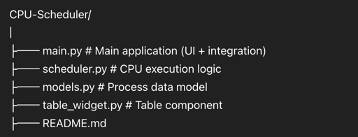

# 🖥️ CPU Scheduler Simulator (PyQt6)

## 📌 Overview

This project is a **CPU Scheduling Simulator** built using **PyQt6**.
It demonstrates how operating systems manage processes using different scheduling algorithms.

The application allows users to:

* Add processes
* Display them in a table
* Simulate CPU execution step-by-step
* Observe how processes are executed over time

---

## 🖼️ Preview



---

## ⚙️ Features

* ✅ Interactive GUI using PyQt6
* ✅ Add processes dynamically
* ✅ Process table visualization
* ✅ Real-time simulation
* ✅ Remaining burst time updates live
* ✅ Algorithm selector (FCFS, SJF, SRTF, RR)
* 🚧 Ready for extension (Gantt chart, metrics)

---

## 🧱 Project Structure

```
CPU-Scheduler/
│
├── main.py                # Main UI + integration
├── CoreEngine.py           # Core simulation logic
├── models.py              # Process data structure
├── table_widget.py        # Table component
├── gantt_widget.py        # (Planned) Gantt chart
├── scheduler_Algorithms   # Contains All algorithms Logib
├── img.png                # UI screenshot
└── README.md

```

---

## 🧠 System Design

The application follows a modular architecture:

```
User Interface (main.py)
        ↓
User Actions (Buttons)
        ↓
Process Model (models.py)
        ↓
Scheduler Engine (scheduler.py)
        ↓
UI Update (Table)
```

---

## ⚙️ How It Works

### 1. Add Process

* Click **Add Process**
* A process is created automatically:

  * ID: P1, P2, ...
  * Arrival Time = 0 (default)
  * Burst Time = 5 (default)
  * Remaining Time = Burst Time

---

### 2. Start Simulation

* Click **Start**
* The system uses a timer to simulate CPU execution
* Every second:

  * One unit of time is executed
  * Remaining burst time decreases
  * Table updates automatically

---

### 3. Execution Flow

```
Add Process → Stored in list → Displayed in table
Start → Timer → run_step()
run_step() → updates process
UI → reflects new values
```

---

## 📊 Table Structure

| Column               | Description                |
| -------------------- | -------------------------- |
| Process ID           | Unique identifier          |
| Arrival Time         | Time process enters system |
| Burst Time           | Total execution time       |
| Remaining Burst Time | Time left to execute       |

---

## 🔄 Algorithms

### ✅ Implemented

* FCFS (First Come First Serve)

### 🚧 Planned

* SJF (Shortest Job First)
* SRTF (Shortest Remaining Time First)
* Round Robin
* Priority Scheduling

---

## 🛠️ Installation

### 1. Install dependencies

```bash
pip install PyQt6
```

---

### 2. Run the application

```bash
python main.py
```

---

## 🎯 Learning Objectives

This project demonstrates:

* GUI development using PyQt6
* Event-driven programming
* CPU scheduling concepts
* Separation of concerns (UI / Logic / Data)
* Real-time simulation

---

## 👨‍💻 Team Work

This project was developed collaboratively:

* UI Design
* Table Component
* Scheduler Engine
* Algorithms Implementation
* Visualization (planned)

---

## 🚀 Future Improvements

* Gantt Chart visualization
* Waiting & Turnaround time calculations
* User input forms
* Algorithm comparison
* Better UI/UX design

---

## 📌 Notes

* Current version uses default process values for testing
* Advanced algorithms are prepared but not fully integrated yet

---

## 📄 License

This project is for educational purposes.
